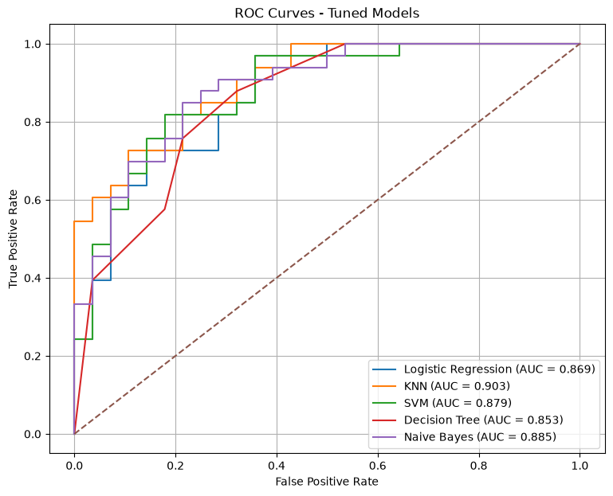
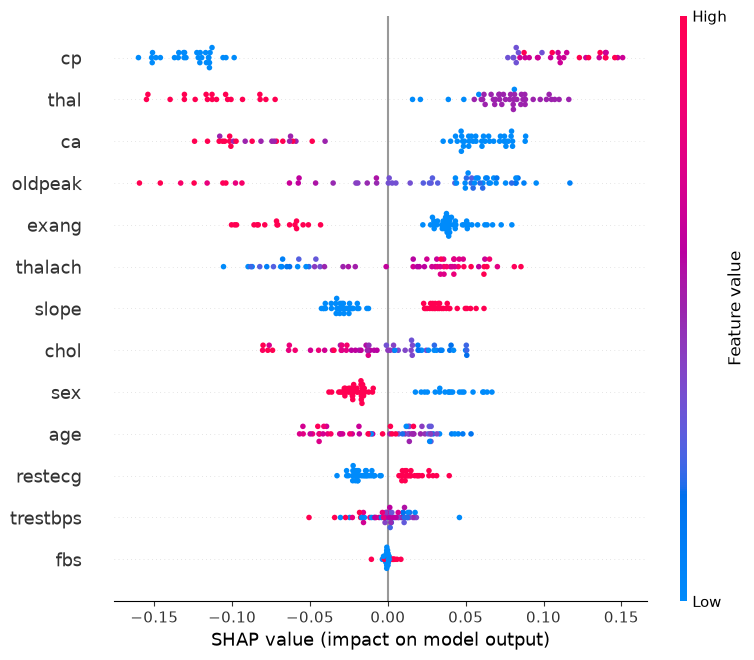
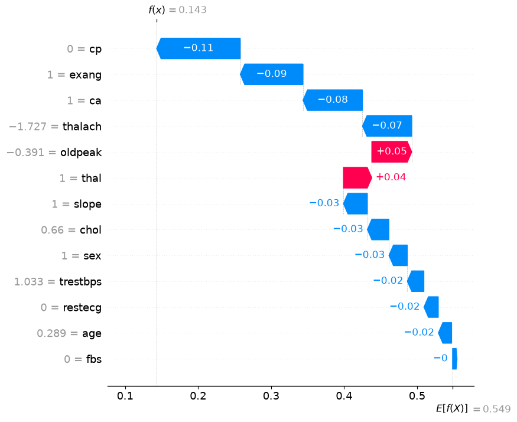
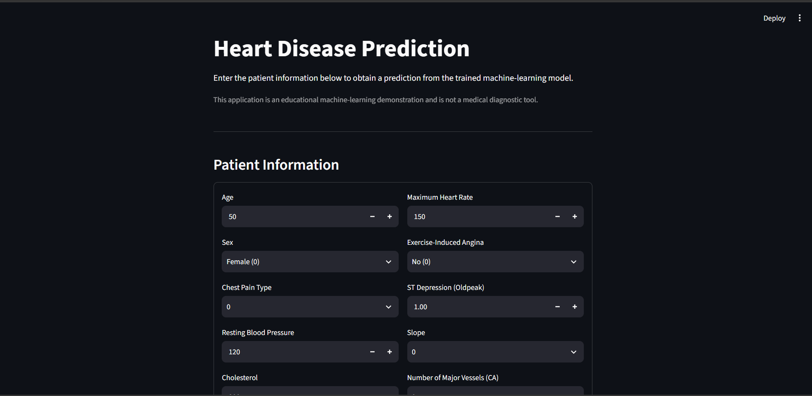

# ML_Projects
# Heart Disease Prediction Using Machine Learning

[](https://www.python.org/)
[](https://scikit-learn.org/)
[](https://pandas.pydata.org/)
[](https://numpy.org/)
[](https://shap.readthedocs.io/)
[](https://streamlit.io/)
[](LICENSE)

> A supervised machine learning study for predicting the presence of heart disease from clinical patient features, with model evaluation, cross-validation, ensemble learning, SHAP-based interpretation, and a Streamlit application.

---

## Overview

This project investigates the use of classical machine learning algorithms for **binary heart disease classification**.

Rather than treating the task as simply "train a model and report accuracy," the project follows a complete machine learning workflow:

```text
Raw Clinical Data
       │
       ▼
Data Inspection & Cleaning
       │
       ▼
Exploratory Data Analysis
       │
       ▼
Feature Preprocessing
       │
       ▼
Train / Test Split
       │
       ▼
Multiple ML Models
       │
       ▼
Cross-Validation
       │
       ▼
Hyperparameter Tuning
       │
       ▼
Ensemble Learning
       │
       ▼
Model Evaluation
       │
       ▼
SHAP Interpretation
       │
       ▼
Streamlit Application
```

The project is intended as an **educational and research-oriented machine learning study**. The resulting model is not a medical diagnostic tool.

---

# Research Question

The main research question is:

> **How effectively can classical supervised machine learning algorithms predict the presence of heart disease from commonly available clinical features, and which features contribute most to the resulting predictions?**

The project therefore evaluates both:

1. **Predictive performance**
2. **Model interpretability**

This distinction is important because a model that produces predictions without explaining its behavior provides limited insight into the underlying data.

---

# Dataset

The project uses the **Cleveland Heart Disease dataset**, containing clinical measurements associated with heart disease.

The original dataset contains:

* **303 observations**
* **14 variables**
* **13 input features**
* **1 binary target variable**

During preprocessing, one duplicate record was identified and removed.

### Final dataset

| Property                  |    Value |
| ------------------------- | -------: |
| Original observations     |      303 |
| Duplicate records removed |        1 |
| Final observations        |  **302** |
| Input features            |   **13** |
| Target variable           | `target` |
| Missing values            |        0 |

The target variable represents the presence or absence of heart disease.

```text
target = 0 → No presence of heart disease
target = 1 → Presence of heart disease
```

---

# Features

| Feature    | Description                           |
| ---------- | ------------------------------------- |
| `age`      | Age of the patient                    |
| `sex`      | Sex                                   |
| `cp`       | Chest pain type                       |
| `trestbps` | Resting blood pressure                |
| `chol`     | Serum cholesterol                     |
| `fbs`      | Fasting blood sugar                   |
| `restecg`  | Resting electrocardiographic result   |
| `thalach`  | Maximum heart rate achieved           |
| `exang`    | Exercise-induced angina               |
| `oldpeak`  | ST depression induced by exercise     |
| `slope`    | Slope of the peak exercise ST segment |
| `ca`       | Number of major vessels               |
| `thal`     | Thalassemia                           |
| `target`   | Heart disease target                  |

---

# Methodology

## 1. Data Inspection

The first stage examined:

* Dataset dimensions
* Data types
* Missing values
* Duplicate records
* Target distribution
* Descriptive statistics
* Feature relationships

This step was performed before model training to identify potential data-quality problems.

---

## 2. Data Cleaning

Duplicate observations were checked and one duplicate row was removed.

The resulting dataset contained:

```text
302 rows × 14 columns
```

No missing values were identified in the cleaned dataset.

---

## 3. Exploratory Data Analysis

Exploratory analysis was used to investigate the statistical structure of the dataset and identify potentially informative features.

The strongest observed target correlations included:

| Feature   | Absolute correlation with target |
| --------- | -------------------------------: |
| `exang`   |                           0.4368 |
| `cp`      |                           0.4338 |
| `oldpeak` |                           0.4307 |
| `thalach` |                           0.4217 |
| `ca`      |                           0.3917 |

These correlations describe relationships within this dataset. They do **not** establish causation or clinical importance.

---

## 4. Train/Test Split

The cleaned dataset was divided into:

| Dataset      | Samples |
| ------------ | ------: |
| Training set |     241 |
| Test set     |      61 |
| Total        |     302 |

The training data was used for model development, while the test set was reserved for final evaluation.

---

## 5. Feature Preprocessing

Different algorithms require different preprocessing strategies.

For models sensitive to feature scale, numerical variables were standardized using a Scikit-learn preprocessing pipeline.

The Logistic Regression workflow, for example, used scaling for continuous numerical variables while retaining the appropriate treatment for other features.

Using a pipeline helps prevent preprocessing leakage between training and test data.

---

# Machine Learning Models

Several classical supervised learning algorithms were investigated.

### Logistic Regression

Used as an interpretable linear baseline for binary classification.

### K-Nearest Neighbors

Classifies observations based on the local neighborhood of training samples.

### Naive Bayes

Provides a probabilistic classification approach based on conditional independence assumptions.

### Decision Tree

Learns a sequence of decision rules that split the feature space.

### Random Forest

Combines multiple decision trees to produce an ensemble prediction and provides feature-importance estimates.

### Support Vector Machine

Constructs a decision boundary designed to separate the classes while maximizing the margin.

---

# Model Comparison

The project evaluates models using several complementary metrics rather than accuracy alone.

| Model               |   Accuracy |  Precision |     Recall |         F1 |    ROC-AUC |
| ------------------- | ---------: | ---------: | ---------: | ---------: | ---------: |
| Logistic Regression | **0.7869** | **0.7632** | **0.8788** | **0.8169** | **0.8647** |
| KNN                 |          — |          — |          — |          — |          — |
| Naive Bayes         |          — |          — |          — |          — |          — |
| Decision Tree       |          — |          — |          — |          — |          — |
| Random Forest       |          — |          — |          — |          — |          — |
| SVM                 |          — |          — |          — |          — |          — |
| Ensemble            |          — |          — |          — |          — |          — |

> The remaining values will be populated from the final cross-validation/model-comparison experiment.

This table is deliberately kept separate from unsupported claims. Model performance should come directly from the experiment rather than being estimated.

---

# Logistic Regression Results

The current Logistic Regression experiment produced the following test-set results:

| Metric    |     Result |
| --------- | ---------: |
| Accuracy  | **78.69%** |
| Precision | **76.32%** |
| Recall    | **87.88%** |
| F1-score  | **81.69%** |
| ROC-AUC   | **86.47%** |

### Confusion Matrix

```text
                 Predicted
                0       1
Actual  0      19       9
        1       4      29
```

This corresponds to:

* True Negative = 19
* False Positive = 9
* False Negative = 4
* True Positive = 29

The relatively high recall in this experiment means the model identified a large proportion of the positive cases in this particular test set.

However, this result should not be interpreted as evidence of clinical effectiveness because the dataset is small and the evaluation uses a specific train/test split.

---

# Cross-Validation

A single train/test split can give an unstable estimate of model performance, particularly when the dataset is relatively small.

Therefore, cross-validation is included to provide a more robust estimate of model behavior across multiple training/validation partitions.

The planned comparison includes:

* Mean accuracy
* Standard deviation of accuracy
* Mean precision
* Mean recall
* Mean F1-score
* Mean ROC-AUC

Example structure:

| Model               | CV Accuracy | CV Precision | CV Recall | CV F1 | CV ROC-AUC |
| ------------------- | ----------: | -----------: | --------: | ----: | ---------: |
| Logistic Regression |           — |            — |         — |     — |          — |
| KNN                 |           — |            — |         — |     — |          — |
| Naive Bayes         |           — |            — |         — |     — |          — |
| Decision Tree       |           — |            — |         — |     — |          — |
| Random Forest       |           — |            — |         — |     — |          — |
| SVM                 |           — |            — |         — |     — |          — |

Cross-validation results should be used together with the held-out test-set results rather than replacing the final test evaluation.

---

# Hyperparameter Tuning

Selected models are further optimized using hyperparameter search.

The purpose is to investigate whether model performance can be improved through systematic parameter selection rather than manually choosing values.

Examples include:

```text
Random Forest
├── number of trees
├── maximum depth
├── minimum samples per split
└── minimum samples per leaf

SVM
├── C
├── kernel
└── gamma

KNN
├── number of neighbors
├── distance metric
└── weighting method
```

The tuned models are evaluated using cross-validation before final testing.

---

# Ensemble Learning

An ensemble model is also investigated by combining predictions from multiple classifiers.

The motivation is that different algorithms can learn different structures from the same dataset.

Conceptually:

```text
             ┌── Logistic Regression ──┐
             │                          │
             ├── Random Forest ─────────┤
Input ───────┤                          ├── Ensemble Prediction
             ├── SVM ───────────────────┤
             │                          │
             └── Other Models ──────────┘
```

The ensemble is evaluated using the same metrics as the individual models.

---

# Model Interpretability

Predictive performance is only one part of the analysis.

This project also investigates **why the model produces its predictions**.

## Random Forest Feature Importance

Tree-based feature importance is used to identify features that contribute strongly to the Random Forest model.

This provides a global view of feature contribution.

## SHAP

SHAP is used for more detailed model interpretation.

The project includes:

* Global SHAP feature importance
* SHAP summary analysis
* Individual prediction explanations
* SHAP waterfall visualization

The goal is to understand both:

```text
Global behavior
       ↓
Which features generally influence predictions?
```

and:

```text
Individual prediction
       ↓
Which features pushed this particular prediction
toward one class or the other?
```

---

# Results and Visualizations

The repository contains generated visualizations from the experiments.

### ROC Curve



The ROC curve illustrates the relationship between the true-positive rate and false-positive rate across classification thresholds.

---

### SHAP Feature Importance



This visualization provides a global view of feature contributions to the model predictions.

---

### SHAP Waterfall



The waterfall plot explains the contribution of individual features for a specific prediction.

---

### Streamlit Application



The Streamlit application provides a simple interface for interacting with the trained model.

---

# Streamlit Application

The project includes a small web application built with Streamlit.

The application allows users to enter clinical feature values and obtain a model prediction.

Run the application with:

```bash
streamlit run app.py
```

Then open:

```text
http://localhost:8501
```

The application is intended for **demonstration and educational purposes only**.

It should not be used to diagnose, treat, or make clinical decisions about an individual.

---

# Project Structure

```text
heart_disease_ml/
│
├── data/
│   └── heart.csv
│
├── models/
│   └── heart_disease_random_forest.pkl
│
├── notebooks/
│   └── ...
│
├── results/
│   ├── roc_curve.png
│   ├── shap_feature_importance.png
│   ├── shap_waterfall_sample0.png
│   └── streamlit_app.png
│
├── app.py
├── README.md
└── .gitignore
```

The `.venv/` directory is intentionally excluded from version control.

---

# Reproducibility

The project is designed around a reproducible Python environment.

Recommended Python version:

```text
Python 3.11
```

Create a virtual environment:

```bash
python -m venv .venv
```

Activate it on Windows:

```bash
.venv\Scripts\activate
```

Install the required packages:

```bash
pip install numpy pandas scipy scikit-learn matplotlib seaborn shap joblib streamlit
```

Run the application:

```bash
streamlit run app.py
```

---

# Limitations

Several limitations should be considered when interpreting the results.

### Dataset size

The final dataset contains only 302 observations. This limits the statistical reliability and generalizability of the results.

### Dataset population

The dataset represents a specific clinical population and should not automatically be assumed to represent other populations.

### Test-set dependence

The reported test metrics depend on the particular data split.

### Feature limitations

The model uses only the variables available in the dataset. Real clinical assessment involves substantially more information.

### Clinical use

This project is a machine learning research/education project and is **not a validated clinical decision-support system**.

---

# Future Work

Several directions could extend the project.

### Model development

* More extensive hyperparameter optimization
* Additional ensemble methods
* Probability calibration
* Threshold analysis
* Additional classification algorithms

### Evaluation

* Repeated stratified cross-validation
* External validation
* Calibration curves
* Precision-recall curves
* Statistical comparison of models
* Error analysis

### Interpretability

* More detailed SHAP analysis
* Partial dependence analysis
* Individual conditional expectation
* Feature interaction analysis

### Deployment

* Improved Streamlit interface
* Model versioning
* Automated inference pipeline
* API-based deployment
* Containerized deployment

### Research

A larger and independently collected dataset could be used to investigate whether the observed patterns generalize beyond the original dataset.

---

# Technologies

| Technology   | Purpose                      |
| ------------ | ---------------------------- |
| Python       | Main programming language    |
| NumPy        | Numerical computation        |
| Pandas       | Data manipulation            |
| SciPy        | Scientific computing         |
| Scikit-learn | Machine learning             |
| Matplotlib   | Visualization                |
| Seaborn      | Statistical visualization    |
| SHAP         | Model explainability         |
| Joblib       | Model serialization          |
| Streamlit    | Application deployment       |
| Jupyter      | Experimentation and analysis |

---

# Key Takeaways

This project demonstrates an end-to-end machine learning workflow:

```text
Data
 ↓
Cleaning
 ↓
Exploration
 ↓
Preprocessing
 ↓
Classification
 ↓
Cross-Validation
 ↓
Hyperparameter Tuning
 ↓
Ensemble Learning
 ↓
Evaluation
 ↓
Interpretability
 ↓
Deployment
```

The important part of the project is not simply obtaining a prediction. The workflow also examines **how reliable the prediction is, how different models behave, and which features influence the model's decisions**.

---

# Disclaimer

This project is intended for **educational and research purposes only**.

The predictions generated by the models should not be considered medical advice, diagnosis, or treatment recommendations. A trained medical professional should be consulted for actual clinical decisions.

---

# Author

**PHON Napha**

Machine Learning & AI Projects

GitHub: [@nanapha-phonn](https://github.com/nanapha-phonn)

---

## Acknowledgment

The project uses the Cleveland Heart Disease dataset and builds upon standard machine learning techniques for binary classification and model interpretation.
